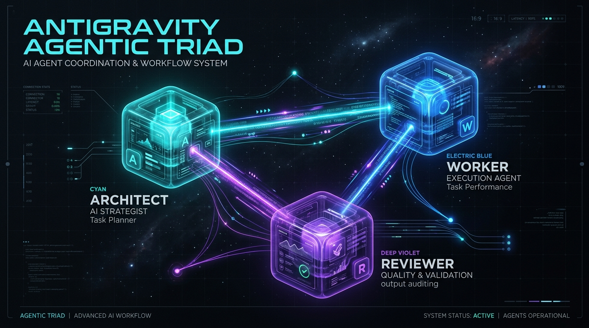
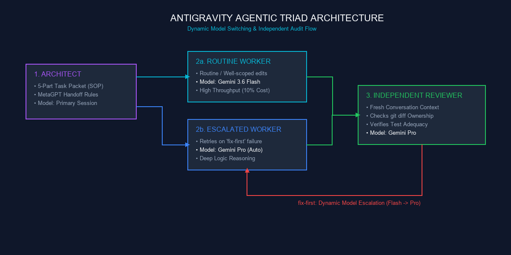
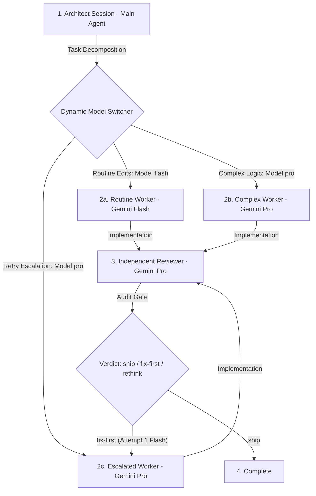

<p align="center">
  
</p>

<h1 align="center">⚡ Antigravity Agentic Triad</h1>

<p align="center">
  <b>The Research-Backed Multi-Agent Workflow for Google Antigravity</b><br/>
  <i>Stop letting AI coding assistants self-approve their own broken code.</i>
</p>

<p align="center">
  <a href="https://github.com/rootkind35-del/antigravity-agentic-triad/stargazers"></a>
  <a href="https://opensource.org/licenses/MIT"></a>
  <a href="https://antigravity.google"></a>
  <a href="references/dynamic-model-switching.md"></a>
  <a href="references/research-foundation.md"></a>
</p>

---

## 🛑 Real-World Developer Pain Points (Reddit Analysis)

Developer communities across **Reddit (r/LocalLLaMA & r/programming)** consistently highlight 6 major flaws in standard single-session AI coding assistants:

| Reddit Developer Pain Point | AI Coding Flaw | Triad Solution | Scientific Grounding Paper |
|---|---|---|---|
| 🧪 **1. Silent Hallucinations & Stubs** | Writing empty `// TODO` blocks | Independent Test Adequacy Audit | **CRITIC** (*ICLR 2024*) & **Reflexion** (*2023*) |
| 🛡️ **2. Out-of-Scope Code Pollution** | Modifying unrelated files | ACI Guardrails & `git diff` checking | **SWE-agent** (*NeurIPS 2024*) |
| 💬 **3. Cascading Chat Hallucinations** | Chat dialogue causing logic drift | SOP 5-part task packet artifacts | **MetaGPT** (*ICLR 2024*) & **ChatDev** (*ACL 2024*) |
| 💰 **4. Token & Cost Explosion** | Querying heavy models for simple edits | Dynamic Model Cascade (`flash` -> `pro`) | **FrugalGPT** (*Stanford 2023*) & **RouteLLM** (*LMSYS 2024*) |
| 🔁 **5. Infinite Retry Loops** | Repeatedly trying broken fixes | Episodic memory ($\Omega \le 3$) & MCTS pruning | **LATS** (*ICML 2024*) & **Self-Refine** (*NeurIPS 2023*) |
| 📦 **6. Context Blindness** | Missing multi-file imports | Explicit public interface contracts | **RepoCoder** (*EMNLP 2023*) & **InterCode** (*NeurIPS 2023*) |

---

## 🚀 The Solution: Antigravity Agentic Triad

**Antigravity Agentic Triad** enforces strict separation of concerns into **3 specialized roles**:

1. 🏗️ **Architect (Primary Agent)**: Owns system design, breakdown, and drafts 5-part Standard Operating Procedure (SOP) packets. *Never writes implementation code directly.*
2. ⚡ **Worker Fleet (Routine & Complex)**: Executes tasks using **Dynamic Model Switching** (Gemini 3.6 Flash for high-speed routine edits; Gemini Pro for complex logic). Automatically escalates from Flash to Pro if errors are caught!
3. 🛡️ **Independent Reviewer (Fresh Context)**: Spawns in an isolated conversation context with **zero prompt history**. Audits `git diff` against declared file scope and judges test adequacy before granting a `ship` verdict.

---

## 📊 Dynamic Architecture & Model Escalation

<p align="center">
  
</p>

### Interactive Workflow Diagram



---

## 🔬 Scientific Hall of Fame (20 Peer-Reviewed Papers)

This repository synthesizes **20 landmark research papers** published in ICLR, NeurIPS, ICML, EMNLP, ACL, OpenAI, Stanford, Princeton, and LMSYS:

| Paper Title | Authors & Institution | Venue | Core Innovation |
|---|---|---|---|
| **MetaGPT** | Hong et al. (DeepWisdom, KAUST, Berkeley) | ICLR 2024 | SOP 5-part task packet artifacts eliminate cascading hallucinations |
| **Reflexion** | Shinn et al. (Northeastern, Princeton) | 2023 | Verbal reinforcement ($sr$) & episodic memory buffer ($\Omega \le 3$) |
| **FrugalGPT** | Chen, Zaharia, & Zou (Stanford University) | Stanford 2023 | Bounded budget optimization ($\mathbb{E}[c] \le b$) saves up to 98% cost |
| **LATS** | Zhou et al. (UIUC, Lapis Labs) | ICML 2024 | Monte Carlo Tree Search (MCTS) trajectory pruning & state reversion |
| **SWE-agent** | Yang et al. (Princeton University) | NeurIPS 2024 | Agent-Computer Interfaces (ACI) with file ownership guardrails |
| **ReAct** | Yao et al. (Princeton, Google Brain) | ICLR 2023 | Interleaving reasoning thought steps with tool execution actions |
| **Tree of Thoughts** | Yao et al. (Princeton, Google DeepMind) | NeurIPS 2023 | Deliberate problem solving via BFS/DFS tree search exploration |
| **Self-Refine** | Madaan et al. (CMU, Allen AI) | NeurIPS 2023 | Iterative self-feedback and refinement without model fine-tuning |
| **CodeRL** | Le et al. (Salesforce AI) | NeurIPS 2022 | Deep RL code synthesis conditioned on unit test execution feedback |
| **CRITIC** | Gou et al. | ICLR 2024 | Tool-interactive critiques with compilers and test runners |
| **ChatDev** | Qian et al. (Tsinghua University) | ACL 2024 | Communicative multi-agent software development waterfall process |
| **AgentVerse** | Chen et al. (Tsinghua University) | ICLR 2024 | Multi-agent dynamic team formation and consensus protocols |
| **SWE-bench** | Jimenez et al. (Princeton University) | ICLR 2024 | Benchmark of 2,294 real-world GitHub software issues |
| **HumanEval** | Chen et al. (OpenAI) | OpenAI 2021 | Standardized Python function synthesis evaluation benchmark |
| **RepoCoder** | Zhang et al. | EMNLP 2023 | Repository-level iterative retrieval-augmented code completion |
| **InterCode** | Yang et al. (Princeton University) | NeurIPS 2023 | Interactive coding environment standard for language agents |
| **Toolformer** | Schick et al. (Meta AI) | NeurIPS 2023 | Self-supervised tool usage insertion in language models |
| **AgentBench** | Liu et al. (Tsinghua University) | ICLR 2024 | Multi-environment agent evaluation framework |
| **RouteLLM** | Ong et al. (LMSYS / UC Berkeley) | LMSYS 2024 | Preference-based classifier routers for cost-effective LLM routing |
| **CodeAgent** | Zheng et al. | 2024 | Tool-integrated reasoning framework for complex software tasks |

For complete proofs, equations, and synthesis breakdowns, read [`references/research-foundation.md`](references/research-foundation.md).

---

## ⚡ 30-Second Quick Start

### 1. Installation
Copy the skill package into your global Antigravity skills folder:

```bash
# Clone and install globally
git clone https://github.com/rootkind35-del/antigravity-agentic-triad.git
cp -r antigravity-agentic-triad ~/.gemini/config/skills/antigravity_agentic_triad
```

### 2. Trigger in Antigravity Chat
Simply tell Antigravity:

> *"Use the Antigravity Agentic Triad workflow to implement feature X."*

---

## 🧪 Benchmark & Verification Suite

Run the built-in diagnostic and simulation tools:

```bash
# Render visual diagram
python scripts/generate_diagram.py

# Run FrugalGPT cost efficiency matrix
python scripts/model_switch_matrix.py

# Validate skill schema & links
python scripts/validate_skill.py .

# Run full workflow simulation
python scripts/run_verification.py
```

---

## ⭐ Support & Star History

If **Antigravity Agentic Triad** saved your project from silent AI bugs, please **give this repository a Star ⭐**! It helps other developers discover research-backed agentic workflows.

<p align="center">
  <sub>Built with ❤️ for the Google Antigravity Developer Community. Released under the MIT License.</sub>
</p>
