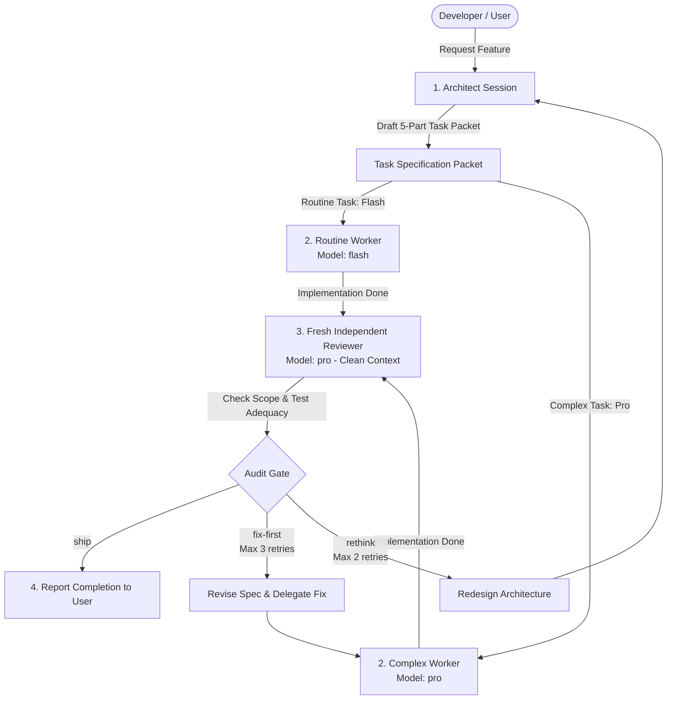

# Antigravity Agentic Triad

An agentic orchestration workflow for **Google Antigravity** built to eliminate LLM self-validation bias.

When an AI coding assistant writes code and tests its own work within the same conversation context, it almost always self-approves. It misses subtle edge cases because its assumptions bleed into its verification. 

**Antigravity Agentic Triad** solves this by strictly separating responsibilities into three distinct roles: **Architect**, **Worker**, and **Fresh Independent Reviewer**.

---

## 🏗 Architecture & Flow



---

## ⚡ Role Breakdown

| Role | Responsibility | Antigravity Engine Mapping |
|---|---|---|
| **Architect** | Primary chat session. Owns requirements, architecture, 5-part task packets, and final acceptance. **Never writes implementation code directly.** | Primary Session Agent |
| **Routine Worker** | Handles repetitive, well-defined, mechanical tasks. | `invoke_subagent` (`Model: flash`) |
| **Complex Worker** | Handles logic-heavy, complex tasks, security-sensitive work, or broad refactors. | `invoke_subagent` (`Model: pro`) |
| **Independent Reviewer** | Spawns in a **fresh subagent session** without previous conversation memory. Audits file scope bounds and test adequacy. | `invoke_subagent` (`Model: pro` in fresh subagent) |

---

## 🛡 Hard Safety Constraints

- **Scope Boundary Enforcement**: The Independent Reviewer compares the actual `git diff` against declared `Files/Ownership`. Modifying files outside the declared list triggers an immediate `fix-first` verdict.
- **Verification Adequacy Audit**: The Reviewer checks whether tests actually evaluate edge cases before trusting test output. Trivial or passing-stub tests return `fix-first` with `"verification insufficient"`.
- **Loop Caps**:
  - Max **3 consecutive `fix-first` retries** per task before escalating to `rethink`.
  - Max **2 consecutive `rethink` cycles** before hard-stopping to ask the user.

---

## 📦 Directory Structure

```text
antigravity-agentic-triad/
├── SKILL.md                     # Main Antigravity Skill definition & workflow rules
├── README.md                    # Repository documentation
├── LICENSE                      # MIT License
├── scripts/                     # Tooling & validation scripts
│   ├── validate_skill.py        # Schema, link & guardrail validator
│   └── run_verification.py      # Workflow simulation & gate tester
├── references/                  # Reference guides
│   ├── architect-guide.md       # Architect guidelines & packet drafting
│   ├── role-contracts.md        # Worker & Reviewer contracts
│   └── antigravity-specs.md     # Antigravity subagent routing mechanics
├── examples/                    # Real-world samples
│   ├── task-packet-sample.md    # 5-part task packet example
│   └── review-outcomes-sample.md# Ship / Fix-First / Rethink verdict examples
└── assets/                      # Reusable templates
    ├── task-packet-template.md  # 5-part task packet template
    └── review-report-template.md# Independent Reviewer audit report template
```

---

## 📥 Installation

Copy the `antigravity-agentic-triad` folder into your global Google Antigravity skills directory:

```bash
# Copy skill package to Antigravity global config
cp -r antigravity-agentic-triad ~/.gemini/config/skills/antigravity_agentic_triad
```

---

## 🚀 How to Use

In your Antigravity chat, trigger the workflow by requesting:

> *"Use the Antigravity Agentic Triad workflow to build feature X."*

The assistant will:
1. Formulate a 5-part task packet (Goal, Files/Ownership, Interfaces, Constraints, Verification).
2. Dispatch implementation to a subagent (`flash` or `pro`).
3. Spawn a clean Independent Reviewer subagent (`pro`).
4. Complete only when the Reviewer returns a verified `ship` verdict.

---

## 🧪 Validation & Testing

Run the included validator and simulator scripts:

```bash
python scripts/validate_skill.py .
python scripts/run_verification.py
```

---

## 📄 License

MIT License. See [LICENSE](LICENSE) for details.
